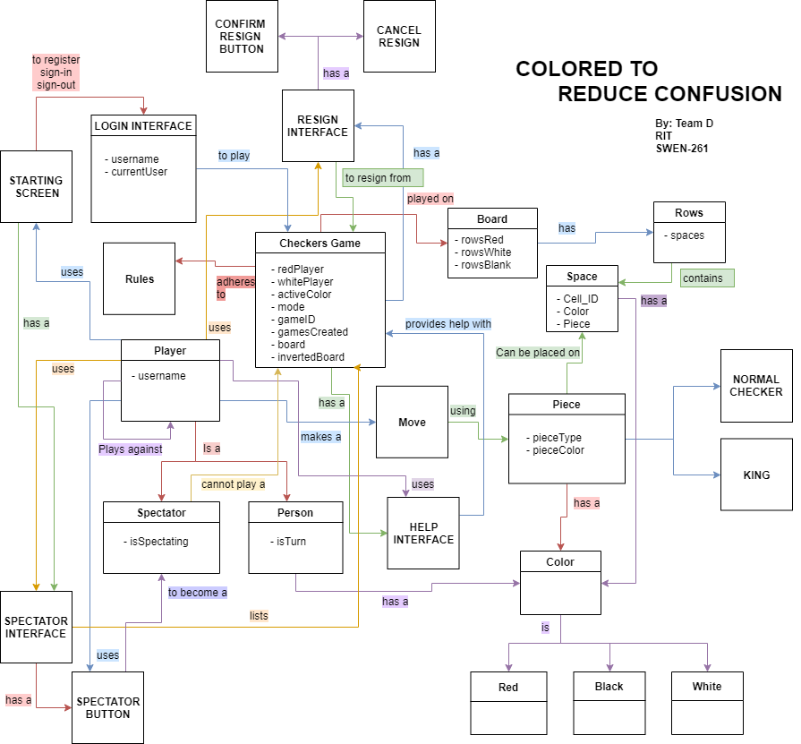
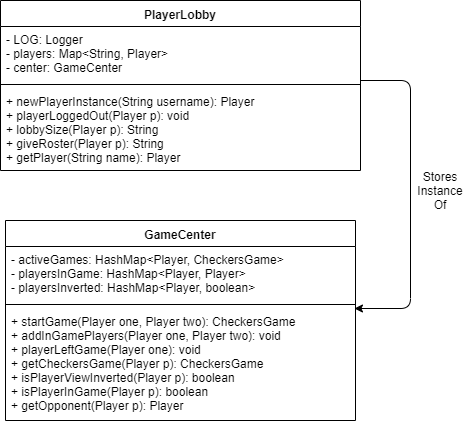
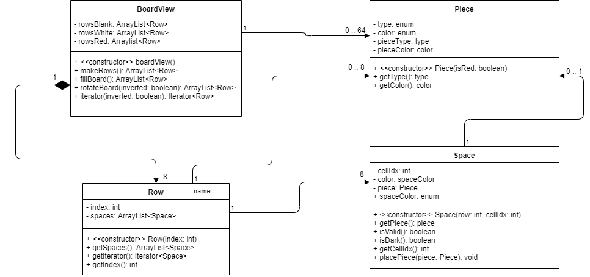
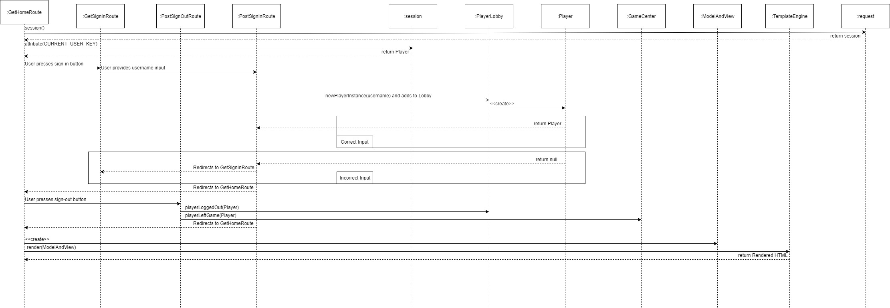
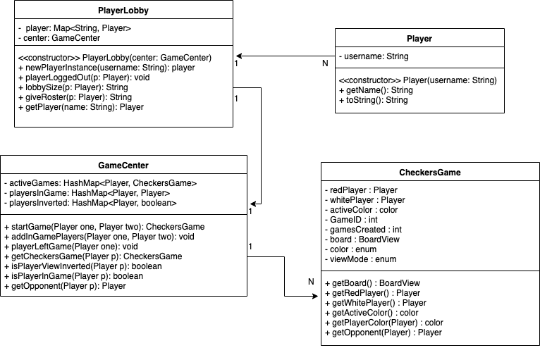
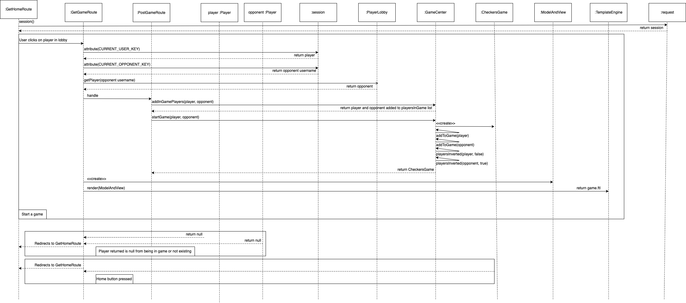
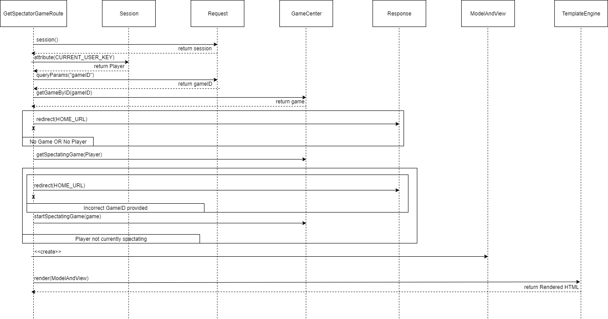
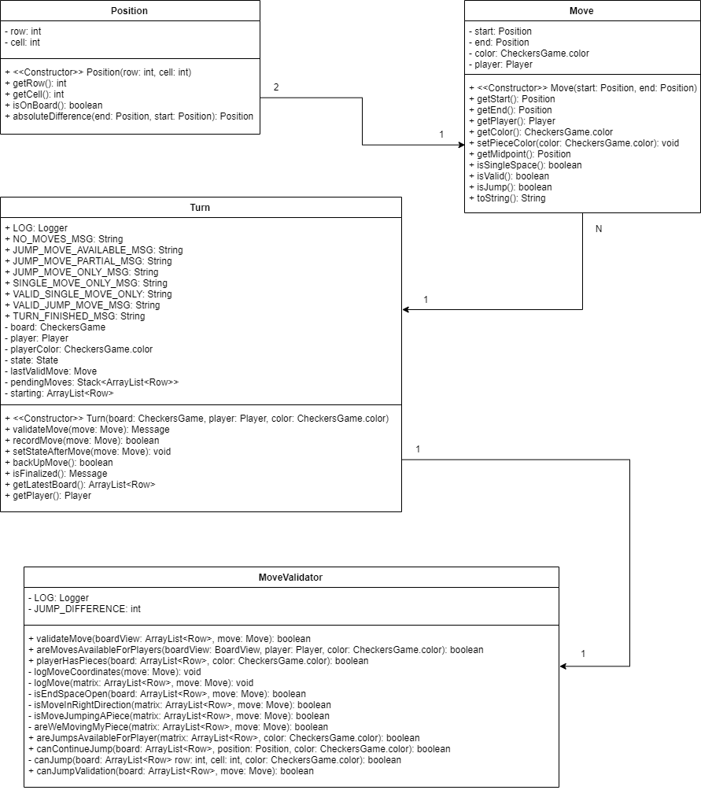
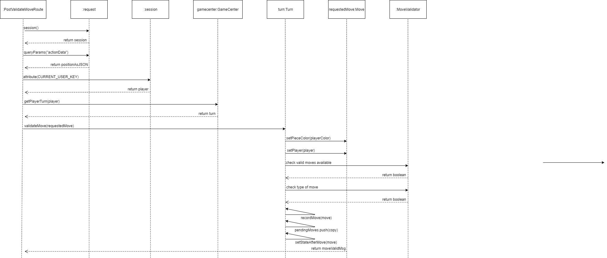
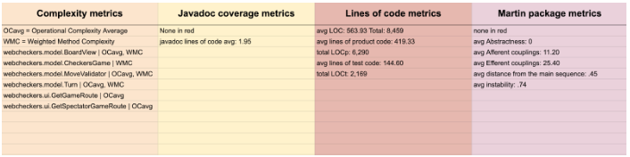

---
geometry: margin=1in
---
# PROJECT Design Documentation

## Team Information
* Team name: SuperAlphaGo
* Team members
  * JUSTIN YAU
  * KYLE MCCOY
  * BRIAN MIRABITO
  * LUYANG LIN

## Executive Summary

WebCheckers is a web based application that allows users to play a functional game of
checkers with other signed-in players. The project utilizes the Spark Micro Web framework and FreeMarker Template Engine.
The high level architecture of the project consists of the UI, Model, and Application tiers.
These tiers provide a logical separation of responsibility. The Agile development cycle was used to gradually
implement the different functionalities of the MVP and related enhancements.

### Purpose
The WebCheckers web application aims for users to play a fully functional game of checkers in a browser.
This game of checkers will adhere to American Rules.

### Glossary and Acronyms

| Term | Definition |
|------|------------|
| VO | Value Object |
| MVP | Minimal Viable Product |
| UI | User Interface |

## Requirements

This section describes the features of the application.

### Definition of MVP

The MVP is an web application where users can sign in, choose an opponent, and then play a game of Web Checkers adhering
to the standard American Rules of Checkers. Players in-game user may choose to resign at any time which will end the game
early.

### MVP Features

1.  **Sign In** Every player must sign-in before playing a game, and be able to sign-out when finished playing.
2.  **Gameplay** This epic ensures the full functionality required for two players to be able to play a game of checkers
based upon the  [American rules](http://www.se.rit.edu/~swen-261/projects/WebCheckers/American%20Rules.html).
3.  **Resignation** Either player of a game may choose to resign, at any point, which ends the game.
4.  **Validate Move** This epic ensures that moves are validated to be legal before being finalized by the application.

### Roadmap of Enhancements
The enhancements of interest to Team D in order of preference are:

1.  _Spectator Mode_: Other players may view an on-going game that they are not playing.
2.  _Game Help_: Players may click a button that provides them assistance in how to play the game.

## Application Domain

This section describes the application domain.

_Figure 1: Domain analysis of the Web Application_

###  Overview of the domain

1. Players log into the web application using the login interface to then be able to start a checkers game with other players.
2. The CheckersGame contains a state of the board which contains rows of spaces of white/black colors and can be occupied by
pieces of red/black colors.
3. Each Piece can be a normal piece or a king piece.
4. Each player that is in-game would be able to make a move and update the state of the CheckersGame accordingly.
5. A player can be spectating, to which they would be unable to make a move in a game, or a actual player, who would be able to play the game.
6. A player can use a help interface to assist with the game.
7. The CheckersGame adheres to the rules defined by the American Rules.

## Architecture and Design

This section describes the application architecture.

### Summary

The following Tiers/Layers model shows a high-level view of the webapp's architecture.

_Figure 2: Diagram of the WebCheckers Architectural Structure_

As a web application, the user interacts with the system using a
browser.  The client-side of the UI is composed of HTML pages with
some minimal CSS for styling the page.  There is also some JavaScript
that has been provided to the team by the architect.

The server-side tiers include the UI Tier that is composed of UI Controllers and Views.
Controllers are built using the Spark framework and View are built using the FreeMarker framework.  The Application and Model tiers are built using plain-old Java objects (POJOs).

Details of the components within these tiers are supplied below.

### Overview of User Interface

This section describes the web interface flow; this is how the user views and interacts
with the WebCheckers application.

_Figure 3: A State Chart that represents the different UI Views_

### Flow of Pages

A first time user would be welcomed to the homepage. From there this user can navigate to the sign-in page
and sign in using a username. Given the username is legal and not in the system already, the user will be
redirected back to the home page where they can view other users to start a game with. From the time that the
user is signed-in, there is a session timeout watchdog listening for inactivity and will automatically log the user
out and if they come back, they would be redirected to the homepage and prompted as if they were a first-time user.
If the user starts a game, they would be directed to the game view and once that game ends, they would have the
option to navigate back to the homepage or sign out and be redirected to the homepage.

### UI Tier
The components of the UI Tier works to provide an interface to view content and provide input to users.
Contents of the UI Tier is often pulled from other tiers. Sometimes, conversion of pulled data
must be performed. The UI tier is responsible for this conversion as well as handling requests by the user.

The UI Tier of the WebCheckers project consists of several components that can be classified into the following:

AjaxRoutes: These routes enable the client's browser to exchange information with the server without refreshing during
gameplay. Not refreshing helps to ensure a smoother experience where the client is not forced to load a new page for
game actions, like validating a move, checking the turn.

*  PostCheckTurnRoute
*  PostResignGameRoute
*  PostSpectatorCheckTurnRoute
*  PostValidateMoveRoute
*  PostSubmitTurnRoute

HTTPRoutes: Unlike the Ajax routes, routes under this classification must be re-rendered each time. These HTTP routes are
responsible for displaying views (a GET request) and updating data from the client (a POST request).

* GetGameRoute
* GetHomeRoute
* GetSigninRoute
* GetSpectatorGameRoute
* GetSpectatorStopWatchingRoute
* PostSignoutRoute
* PostSigninRoute
* WebServer

### Application Tier
The Application Tier manages logic and state of information of the general application as a whole.
It provides client-specific services to the UI Tier so that it can generate the proper views.

This tier in our application consists of the GameCenter and PlayerLobby components. GameCenter keeps a state of all
active games and players in-game along with their opponents. This will prove crucial when it comes to determining if
a player is in-game or not and retrieving game state. Handles to start and end a game are also a part of this component.
PlayerLobby keeps a state of all signed-in players and determines legality of the usernames of the users trying to sign in.
Handles to log in and log out are a part of this component. All of these components formats and provides their respective
information to the UI Tier so it can generate the proper view.

Here is a UML Diagram that illustrates how the classes in the Application Tier work together:

### Model Tier
The Model Tier contains components where it holds actual information pertaining to the state of the board. These components
will be updated to update the state of the board with the aid of helper functions to translate information to the UI tier.
This tier's main responsibility is to store the representations of the Board, Space, and Piece for the game.

_Figure 4: Structural Class Diagram for Model Tier_

The Board component stores the state of the red player's board and white player's board. This will be primarily used by the game
view to retrieve the representation of the boards at a certain period of time to be displayed.

The Piece component stores information regarding what color it is so that players can identify which are theirs to move.
This information is also used by the other tiers to determine if a move is legal.

The Space component stores the state of a space on the board. It can be occupied by a piece and keeps track of colors. This
will be used to display each specific space on the board.

There is also a player model component that represents a player. This component's primary responsibility is to store and
return the username of a player. It will be primarily used by the PlayerLobby application tier component to display rosters
and determine lobby size.

## System: Player Sign-In and Player Sign-Out

This section will describe the functionality of the Player Sign-In/Sign-Out.

### Purpose of system

This system aims to allow the players to sign into the web application with a unique username that allows other users
to identify them with. Users can enter a username which will be checked to not match any online players' usernames and
with success, they would be able to play a game of checkers adhering to American Rules. With username input failures,
the player would be prompted to enter another username after being notified of the error. Users can then log out at any
point to which the system would handle all necessary clean up to allow another user to log in with the same username.

### Static Models

_Figure 5: Static Model for Login System_

### Dynamic Models

_Figure 6: Sequence Diagram for Login System_

## System: Start Game

This section will describe the functionality of how we start a checkers game.

### Purpose of system

This system aims to allow the player to start a checkers game by clicking on the name of another user in the player lobby. When the user does this, on success, the user will be launched into the game route and be shown a board with the user as the white player and the opposing player as the red player. They will then be able to play a game of checkers adhering to American Rules. If one of the players is in a game or leaves the lobby, then the game route will redirect the user back to the home screen. The game route will also redirect the user back to the home page if they click the home button inside the game view.

### Static Models

_Figure 7: Static Model for Game System_

### Dynamic Models

_Figure 8: Sequence Diagram for Game System_

## System: Spectate Game

This section will describe the functionality of how we spectate a checkers game.

### Purpose of system

This system aims to allow the player to spectate a game of checkers that is currently being played by 2 other players.
They would be able to start spectating by clicking on spectate {PLAYER NAME} on the homepage. The user will be redirected
automatically to the game view of the game they selected. The user will then receive live updated periodically and will
be able to stop spectating at any time.

### Static Models

_Figure 9: Static Model for Spectator System_

### Dynamic Models

_Figure 10: Sequence Diagram for Spectator System_

## System : Validate Move

This sections will describe the functionality of how we validate a player's move.

### Purpose of System

This system aims to validate a player's move when a player moves a piece during that player's turn. When a player makes a move they will notified if their move is valid. If their move isn't valid the system will reset their piece and provide them a message stating why the move was invalid. Once the player makes a valid move, the submit move button will be made clickable.

### Static Models

_Figure 11: Static Model for Validation System_

### Dynamic Models

_Figure 12: Sequence Diagram for Validation System_

### Design Improvements

_Figure 13: Code Metric Results_

After running the four different metrics test profiles and seeing how our project handles them, we have found a few areas that would be subject to redesign/reimplementation. 

We found that our project had high complexity and coupling mainly in the model package, which is causing our project instability rating to be higher than what would be optimal in our group’s opinion. Since we were able to identify that the cause of this was mainly in the model package our approach would be to help to alleviate the load on some of the bigger classes and to try and create some helper classes or methods within the classes instead of keeping our large methods that handle a lot of work inside them. By alleviating the coupling in our model class, our average afferent coupling by a lot as that is the main value causing the average to be high. 

On the other side, our UI package is the reason for our high efferent coupling value as the package alone has an efferent coupling value of 96. However, we didn’t see this as too large of a problem because just by the nature of the classes and packages that the UI tier uses, a higher efferent coupling value is inevitable. 

Lastly, we thought that our project will benefit from added Javadoc comments. After seeing our low project average, we thought that bringing it up would be a simple task that would make our project easier to understand by anyone who wanted to work on it or learn from it.

### UI Changes

I would recommend to make the navigation bar much more visible by
making it bigger or something related. A first time user may be puzzled as
to what they would need to do when they first reach the homepage as the
page welcomes them but does not direct them to sign in and they don’t
notice the nav bar. I would also change the welcome message to direct
them to sign in, if they are not already.

The website should also be checking if the game ended periodically
for players who are in their turn currently. If a player who is waiting for their
move resigns, the player who is making the move is not notified until they
make a move and try to submit it or refresh the page. This may confuse
users as to what happened.

Certain fonts should also be bolded to make it easier to read and the
message texts should be shortened to a nice brief sentence so the user
does not get disturbed with a wall of text. More enticing buttons would also
make a nice addition for the users to click on when starting a game or
spectating a game.

Instead of providing the rules to users, I could make it intuitive by
implementing an all possible moves viewer for users so that they could see
all the moves that are legal when they click a piece. This would reduce the
chances that an error is made significantly if the users are able to notice
the suggestions and make the gameplay much more smooth. This feature
would be enabled by default and can be disabled if players want to have a
more serious game of checkers.

## Testing

This section will provide information about the testing performed
and the results of the testing._

### Acceptance Testing
20/20 user stories have passed their acceptance criteria tests as of date. We have not found any 
issues with the latest version. 

### Unit Testing and Code Coverage
For unit testing, we tried to achieve full coverage for each of the classes that we wrote unit tests for. 
We tried accounting for all possible cases when it comes to testing to ensure that our web application
is bug-free. Currently there are some issues with getting coverage after a route redirect. We've tried
checking that the route returns null but that proved ineffective. If there's a solution that we discover later down the
line, we will implement that towards all applicable routes. 
